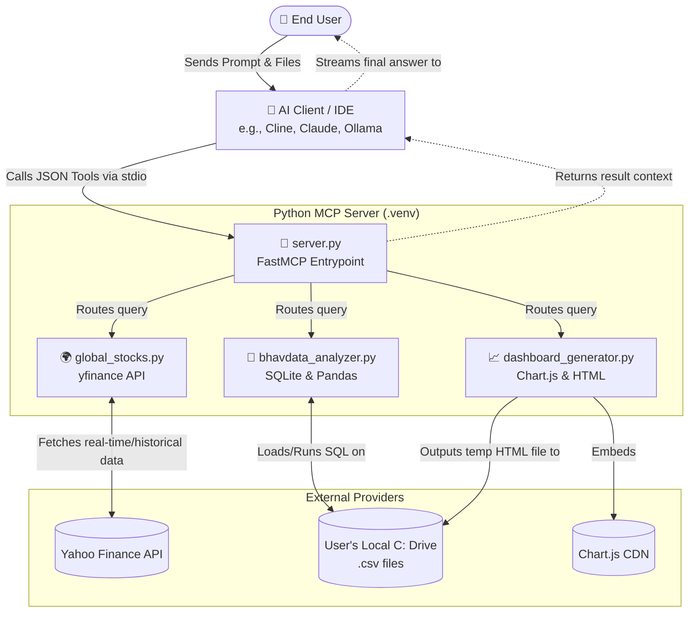

# 📈 MCP Stock Analyzer

An official **Model Context Protocol (MCP)** server for dynamically analyzing Global/Indian stocks and offline local NSE BhavData documents using AI.

⭐ **Core Capabilities:**
- **Global Stocks:** Automatically grabs live prices, history, fundamentals, and ticker resolution via `yfinance`.
- **Local BhavData:** AI dynamically writes SQL statements to extract massive local datasets.
  - ⚠️ **CRITICAL WARNING:** Do **not** use the "Add Context" button (or drag-and-drop) to upload huge BhavData CSVs directly into your chat. This will instantly blow up your AI's token limits and cost a fortune. Instead, simply paste the *absolute file path* (e.g., `"Analyze C:\downloads\bhav.csv"`) as normal text in your prompt, and let this MCP server securely query it in the background!
- **Visual Dashboards:** The AI creates completely interactive, localized HTML graphing dashboards on demand.

## 🏗️ System Architecture 
*(You can copy this Mermaid schema over into Draw.io or securely view it natively inside Markdown viewers)*


---

## 🛠️ Installation & Quick Setup

To guarantee there are zero package or import errors, please set up the isolated environment:

1. Open a terminal navigating to the project folder (`d:\Projects\MCPAgentStockAnalyzer`).
2. Run these configuration commands to set up the dependencies firmly in a `.venv`:
   ```powershell
   python -m venv .venv
   .\.venv\Scripts\activate
   pip install -r requirements.txt
   ```
*(If you use VSCode, `.vscode/settings.json` is automatically pre-configured to select this virtual environment.)*

---

## 🔌 Connecting to LLM Clients
To have your AI interact with this server, you'll simply embed its configuration into your specific tool's config file.

Here is the master **Configuration JSON** you will use for *every* client listed below:
```json
"StockAnalyzer": {
  "command": "d:/Projects/MCPAgentStockAnalyzer/.venv/Scripts/python.exe",
  "args": ["d:/Projects/MCPAgentStockAnalyzer/src/server.py"]
}
```

### 1. Claude Desktop (Mac / Windows)
1. Open up Claude Desktop application.
2. Go to **Settings > Settings file** or navigate to `%APPDATA%\Claude\claude_desktop_config.json`.
3. Add the `StockAnalyzer` block above right inside the `"mcpServers": { ... }` object. 
4. Restart Claude Desktop.

### 2. Cline (VS Code Extension)
1. In VS Code, click the **Cline Extensions** icon on the sidebar.
2. Click the specific **MCP server (plugin) settings** config near the bottom.
3. Paste the configuration block directly into your `mcp_settings.json`.

### 3. Antigravity (Local IDE Agent)
1. Inside your `~/.gemini/antigravity/` folder (or active brain/project `.gemini` folder).
2. Edit the `mcp_config.json` file.
3. Drop the `StockAnalyzer` block into `"mcpServers"`. Keep chatting and it hot-reloads dynamically!

### 4. GitHub Copilot
Currently, GitHub Copilot integrates officially directly with the **Claude** or **OpenAI** engines on newer IDE builds via specific marketplace extensions. If utilizing *Copilot Chat*, ensure you rely on an editor like **VSCode or Cursor** equipped directly with extensible Tool/Plugin settings (similar to Cline's `mcp_settings.json`) that bridge custom MCP standard definitions.

### 5. Claude Code (CLI)
If you're using Anthropic's new direct CLI tool (`claude-code`), configure it simply by defining it as a server in its explicit config file:
```bash
claude config set --mcp-server StockAnalyzer "d:/Projects/MCPAgentStockAnalyzer/.venv/Scripts/python.exe d:/Projects/MCPAgentStockAnalyzer/src/server.py"
```

---

## 🦙 Running completely FREE (Local LLMs)

You do **not** need a paid Claude 3.5 Sonnet or OpenAI API key to use this. You can direct local frameworks through **Cline** or **Cursor** directly to a local engine.

### Using Ollama
1. Download [Ollama](https://ollama.com/)
2. Open terminal and run a fast coder model: `ollama run qwen2.5-coder:7b`
3. Point Cline's settings to **Base URL:** `http://localhost:11434/v1`

### Using LM Studio
1. Download [LM Studio](https://lmstudio.ai/)
2. Load any GGUF model (`Llama-3.1-8B-Instruct`) and start the Local Web Server plugin (`Port 1234`).
3. Set your Cline settings provider to **OpenAI Compatible**, Base URL: `http://localhost:1234/v1`.

### ✨ How to Trigger the Dashboard Tool
Simply ask your LLM: *"Show me the graphical performance of Reliance from the past 6 months."*
The MCP tool will instantaneously compile a stunning `Chart.js` dashboard, save it explicitly to your temporary disk directory, and give you the local URL (e.g., `file:///C:/temp/RELIANCE_dashboard_6mo.html`) to tap directly in your Chrome browser!
